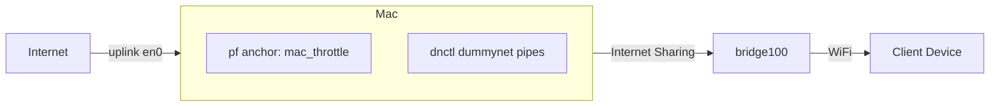

# mac-network-throttle

Turn a Mac into a **network-throttling WiFi hotspot**. Connect a device (phone,
set-top box, smart TV, etc.) to the Mac's hotspot, then control that device's
**bandwidth** and **IP access** in real time from the command line.

Traffic shaping is done entirely with built-in macOS facilities — `pfctl` +
`dnctl` (dummynet) — loaded into a dedicated pf **anchor** so the system's own
packet-filter rules are never clobbered. No kernel extensions, no Docker/VMs, no
deprecated `ipfw`, no Linux-only `tc`/`netem`.

## Supported macOS versions

Monterey (12), Ventura (13), Sonoma (14), and Sequoia (15) — Intel and Apple
Silicon. Interface names (uplink and the `bridge1xx` NAT interface created by
Internet Sharing) are detected dynamically and never hardcoded.

## How it works



* **Internet Sharing** bridges your uplink to WiFi, creating a NAT bridge
  interface (typically `bridge100`, detected at runtime).
* Per-device **dummynet pipes** enforce bandwidth, packet loss, and latency.
* **pf anchor rules** steer each device's traffic into its pipes and enforce
  IP block / allow-only policies.
* All configuration is persisted to a JSON state file; every command rebuilds
  the full pipe + anchor ruleset from that state (idempotent, no orphan rules).

## Prerequisites

| Requirement          | Details                                                        |
|----------------------|----------------------------------------------------------------|
| Operating system     | macOS 12–15 (Monterey, Ventura, Sonoma, Sequoia), Intel or ARM |
| Python               | 3.8 or newer (`python3 --version`)                             |
| Privileges           | An admin account; state-changing commands need `sudo` (root)   |
| System utilities     | `pfctl`, `dnctl`, `arp`, `ifconfig`, `route`, `networksetup`, `launchctl`, `defaults` — all ship with macOS |
| Python packages      | **Runtime: none** (standard library only). **Dev/testing:** `pytest`, `pytest-cov` |

No third-party runtime dependencies, no kernel extensions, no Docker/VMs.

## Installation

```bash
cd mac-network-throttle
python3 -m pip install -e .
# or, for development (adds pytest + pytest-cov):
python3 -m pip install -e ".[dev]"
```

This installs the `mac-throttle` console command. If you prefer not to install,
run it directly as a module from the project root:

```bash
sudo python3 -m throttle.cli status
```

The tool depends only on the Python standard library plus macOS system
utilities.

## Internet Sharing setup (one-time, GUI step)

Fully automating the **WiFi side** of Internet Sharing (SSID + password) is not
reliably supported via the macOS command line across all versions (the old
`airport` utility was removed and the WiFi plist layout is undocumented and
version-specific). The tool automates everything else and prints an explicit
guide for the single manual step:

1. **System Settings → General → Sharing → Internet Sharing (i)**
2. *Share your connection from:* your uplink (Ethernet or Wi‑Fi).
3. *To computers using:* tick **Wi‑Fi**.
4. **Wi‑Fi Options…** → set Network Name (SSID), WPA2/WPA3 Personal, password.
5. Toggle **Internet Sharing ON**.

Then arm the tool:

```bash
sudo mac-throttle start --ssid MyHotspot --no-wait
```

`start` configures NAT sharing, requests the Internet Sharing daemon, detects
the NAT bridge interface, enables the pf anchor, and persists state. Run without
`--no-wait` to keep it in the foreground (Ctrl-C cleans everything up).

## Usage

All state-changing commands require **root** (`sudo`). Add `--dry-run` to any
command to print the exact `pfctl`/`dnctl` commands without applying them (works
without root).

### Bandwidth throttling

```bash
# Presets: 0 (block), 50k, 100k, 256k, 512k, 1m, 3m, 5m, 10m, unlimited
sudo mac-throttle throttle --ip 192.168.2.10 --bandwidth 256k
sudo mac-throttle throttle --ip 192.168.2.10 --bandwidth 1m
sudo mac-throttle throttle --all --bandwidth 512k          # every connected device
sudo mac-throttle throttle --ip 192.168.2.10 --bandwidth 0 # full block

# Arbitrary kbps value:
sudo mac-throttle throttle --ip 192.168.2.10 --bandwidth 768

# Realistic network simulation (packet loss % + one-way latency ms):
sudo mac-throttle throttle --ip 192.168.2.10 --bandwidth 1m \
     --packet-loss 5 --latency 40

# Remove the limit:
sudo mac-throttle throttle --ip 192.168.2.10 --bandwidth unlimited
```

Throttle changes apply **live** without disconnecting the client.

### IP blocking

```bash
# Block specific destinations / CIDR ranges for a device:
sudo mac-throttle block --ip 192.168.2.10 --block-ips 8.8.8.8,142.250.0.0/16

# Whitelist mode: allow ONLY these destinations, block everything else:
sudo mac-throttle block --ip 192.168.2.10 --allow-only-ips 10.0.0.0/24,1.1.1.1

# Remove blocks:
sudo mac-throttle unblock --ip 192.168.2.10 --block-ips 8.8.8.8  # specific
sudo mac-throttle unblock --ip 192.168.2.10                      # all blocks
sudo mac-throttle unblock --ip 192.168.2.10 --clear-allow        # exit whitelist
```

### Inspection

```bash
mac-throttle list-devices   # IP, MAC, bandwidth, blocked + allow-only per client
mac-throttle status         # hotspot state, pf status, device count, active rules
```

### Teardown

```bash
sudo mac-throttle stop                 # remove ALL rules/pipes, restore pf, stop sharing
sudo mac-throttle stop --keep-hotspot  # remove rules only, leave hotspot running
```

`stop` and the SIGINT/SIGTERM signal handler flush the pf anchor, delete every
dummynet pipe, restore the original `/etc/pf.conf` (re-disabling pf if it was
off originally), and clear state — leaving no orphaned rules.

## Command reference

| Command        | Purpose                                                   |
|----------------|-----------------------------------------------------------|
| `start`        | Enable Internet Sharing + pf anchor, arm throttling.      |
| `stop`         | Remove all rules/pipes/anchors, restore original state.   |
| `status`       | Show hotspot state, pf status, device count, active rules.|
| `throttle`     | Set per-device bandwidth, packet loss, latency.           |
| `block`        | Block destination IPs/CIDRs or enable whitelist mode.     |
| `unblock`      | Remove block rules / exit whitelist mode.                 |
| `list-devices` | List connected clients with IP, MAC, and rule state.      |

Global flag: `--dry-run` (print commands without executing).

## State, logs, and files

* State: `${THROTTLE_STATE_DIR:-/var/run/mac-network-throttle}/state.json`
* Log:   `${THROTTLE_STATE_DIR:-/var/run/mac-network-throttle}/throttle.log`
  (every rule/state change is timestamped)
* pf anchor name: `mac_throttle` (appended to `/etc/pf.conf`, never replacing it)

Set `THROTTLE_STATE_DIR` to relocate state/logs.

## Testing

Unit tests mock every subprocess call (`pfctl`, `dnctl`, `arp`, `ifconfig`,
`route`, `networksetup`); they need **neither root nor network changes** and are
safe to run on any machine.

### Install test dependencies

```bash
python3 -m pip install -e ".[dev]"
# or just:
python3 -m pip install pytest pytest-cov
```

### Run the suite

```bash
# From the project root (mac-network-throttle/):
python3 -m pytest -q                                    # run all tests
python3 -m pytest -q --cov=throttle --cov-report=term-missing   # with coverage
python3 -m pytest tests/test_firewall.py -v             # a single file
python3 -m pytest tests/test_cli.py::test_start_no_wait -v   # a single test
```

### What the test cases cover

| Test file                                            | Focus                                                                                     |
|------------------------------------------------------|-------------------------------------------------------------------------------------------|
| [tests/test_throttle.py](tests/test_throttle.py)     | Bandwidth parsing (presets, `k`/`m` suffixes, raw kbps, `unlimited`, `0`), invalid input, `dnctl` pipe command generation with packet loss + latency, pipe apply/delete/flush. |
| [tests/test_firewall.py](tests/test_firewall.py)     | IP/CIDR validation, overlapping-CIDR handling, per-device pf rule generation (throttle, full block, block-specific, allow-only whitelist ordering), anchor ruleset assembly, idempotent `pf.conf` augmentation, pf enable/flush/restore. |
| [tests/test_devices.py](tests/test_devices.py)       | ARP table parsing, MAC normalization, incomplete-entry filtering, device discovery with `-i` fallback, state merge (including offline devices), interface detection from `route`/`ifconfig`. |
| [tests/test_cli.py](tests/test_cli.py)               | Argument parsing and subcommand routing, state persistence, `--all` vs `--ip` targeting, `--dry-run`, root enforcement, `start` bridge-detection flow.                          |
| [tests/test_cleanup.py](tests/test_cleanup.py)       | Teardown flushes anchor + pipes and restores original pf state, before/after rule capture, `stop` when nothing is running, `--keep-hotspot`, signal-handler cleanup.            |
| [tests/test_utils.py](tests/test_utils.py)           | Real subprocess execution + `--dry-run`, privilege checks, JSON state save/load/corruption handling, pipe allocation, logging.                                                  |

Edge cases exercised include: invalid IPs, overlapping CIDR ranges, bandwidth of
`0` (full block), removing a rule that does not exist, calling `stop` with
nothing running, and verifying cleanup removes exactly the rules that were added.

Deterministic parsing tests use sample command output under
[tests/fixtures/](tests/fixtures) (sample `arp`, `ifconfig`, `pfctl -sr`,
`pfctl -s info`, and `route` output). Coverage on the non-CLI modules exceeds 90%.

## Safety notes

* Never modifies the base pf ruleset — rules live in a private anchor.
* `--dry-run` previews every command; runnable without root.
* Cleanup is idempotent: running `stop` when nothing is active is harmless.
* Requires root for anything that mutates network state, with a clear prompt
  when run without sufficient privileges.
